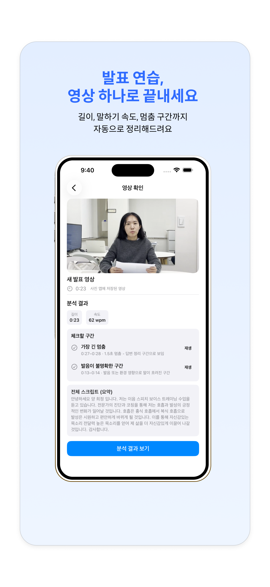
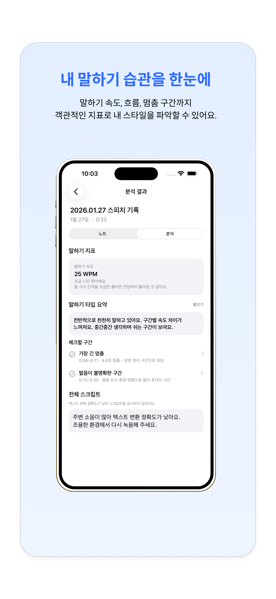
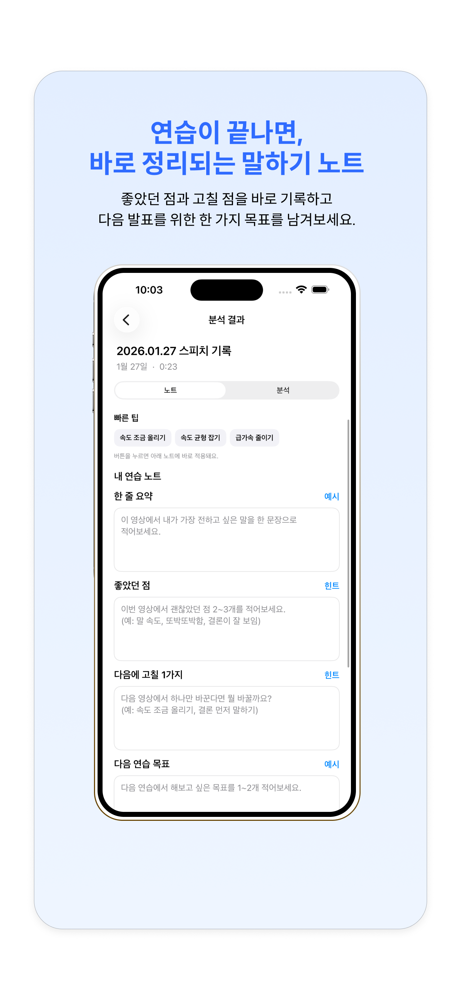
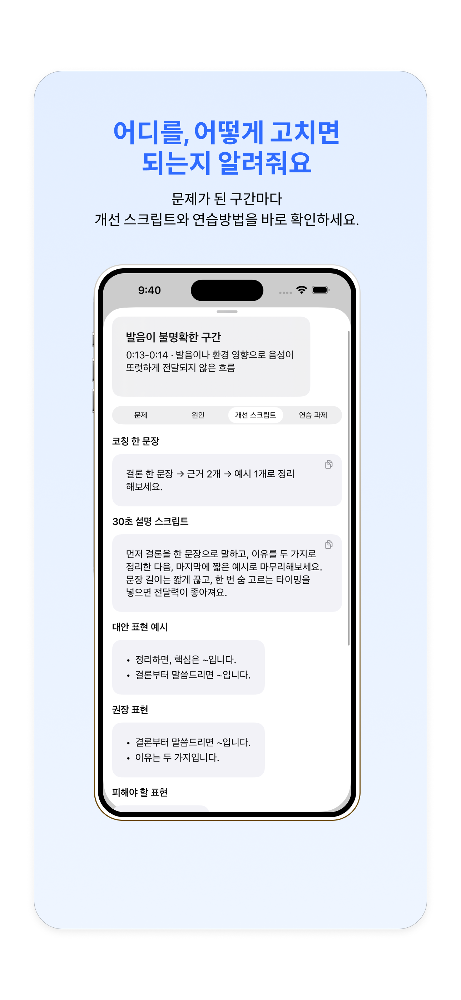

# 🎤 Speech Coach

말하기 영상을 분석해 **발화 흐름 · 전달력 · 말하기 습관을 개선**할 수 있도록 돕는  
iOS 기반 스피치 코칭 앱입니다.

> 단순 분석이 아닌,  
> **사용자가 스스로 말하기를 개선할 수 있도록 돕는 구조**에 집중했습니다.
## 기획 및 개발 기록
이 프로젝트를 기획하며 어떤 판단을 했는지,
MVP 범위를 어떻게 정리했는지를 정리한 글입니다.
- 🔗 [판단하며 줄이고 출시한 iOS 앱 만들기 (1)](https://velog.io/@puuurm/판단하며-줄이고-출시한-iOS-앱-만들기-1)
---

## 📱 App Preview

| Analysis Overview | Analysis Detail | Practice Note | Coaching |
|------------------|----------------|----------------|-----------|
|  |  |  |  |

---
## 🛠 Tech Stack

- **Language**: Swift  
- **UI**: SwiftUI  
- **Architecture**: MVVM  
- **Persistence**: Core Data  
- **Media**: AVFoundation  
- **Monitoring**: Firebase Crashlytics
  
## 🧩 Architecture
### Layered Responsibility

```
App (Environment & External Dependencies)
   ↓
Feature (UI / ViewModel)
   ↓
Analysis Module (Pure Logic, No Framework Dependency)
```
### Project Structure
```
SpeechCoach
├── App (iOS Application Layer)
│   ├── App        
│   ├── Feature      
│   ├── Domain    
│   ├── Store     
│   ├── Shared      
│   └── Resource    

├── SpeechCoachAnalysis (Pure Analysis Framework)
│   ├── Interface 
│   ├── Analyzer    
│   ├── Strategy  
│   ├── Logic       
│   └── Model  

└── SpeechCoachAnalysisTests
    └── UnitTests   

```
> 분석 도메인을 App Target과 분리된 Framework로 구성하여 Firebase·UI 의존성 없이 단위 테스트가 가능하도록 만들었습니다.

## 📦 Release
App Store 출시 완료 (v1.0)


## 🧑‍💻 Author

- iOS Developer  
- 개인 프로젝트 / App Store 배포 경험  
- 관심사: UX 중심 앱 설계, 사용자 행동 분석


## 🔧 Setup

Firebase 설정 필요:


```GoogleService-Info.plist```는 보안상 포함되어 있지 않습니다.


To build the app:
1. Create your own Firebase project
2. Add an iOS app with your Bundle ID
3. Download `GoogleService-Info.plist`
4. Place it at:
   `SpeechCoach/SpeechCoach/GoogleService-Info.plist`
